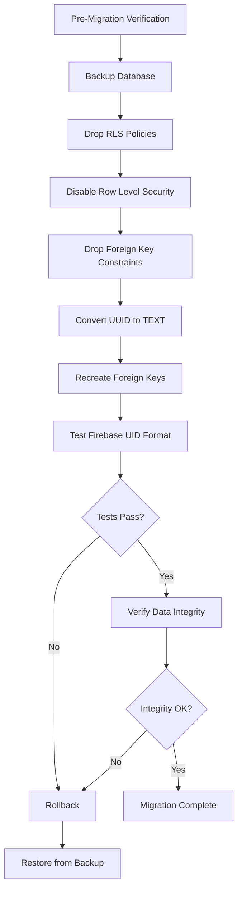
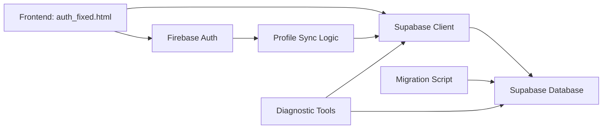
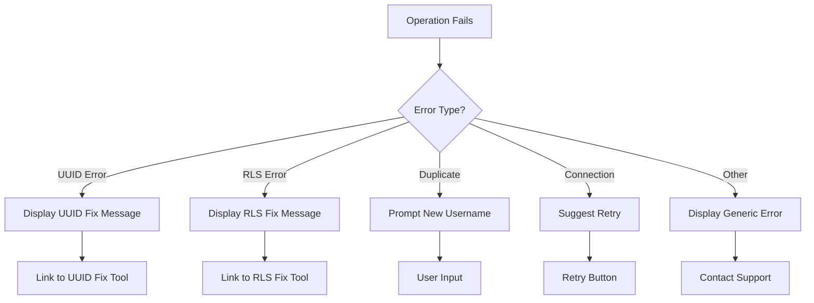

# Design Document: Firebase-Supabase UUID Fix

## Overview

This design addresses the fundamental incompatibility between Firebase Authentication's TEXT-based user IDs and Supabase PostgreSQL's UUID-typed columns. Firebase generates UIDs like "3MTA7worwtc3m0B6k8eQdRz5mSf1" while the current Supabase schema expects RFC 4122 UUID format (e.g., "550e8400-e29b-41d4-a716-446655440000"). This mismatch causes "invalid input syntax for type uuid" errors that prevent user profile creation and break the authentication flow.

The solution involves a comprehensive database migration that converts all UUID columns to TEXT type while maintaining data integrity, foreign key relationships, and providing robust error handling throughout the process.

### Design Goals

1. **Zero Data Loss**: Preserve all existing data during migration
2. **Referential Integrity**: Maintain all foreign key relationships with TEXT IDs
3. **Safe Migration**: Provide rollback capabilities at each step
4. **Clear Diagnostics**: Offer detailed error messages and diagnostic tools
5. **Minimal Downtime**: Execute migration efficiently with verification steps

## Architecture

### High-Level Migration Flow



### Component Architecture



### Migration Strategy

The migration follows a **phased approach** with explicit checkpoints:

1. **Phase 1: Preparation**
   - Create database backup
   - Record table row counts
   - Document current schema state

2. **Phase 2: Policy Removal**
   - Dynamically discover all RLS policies
   - Drop policies using PL/pgSQL loops
   - Disable RLS on all tables

3. **Phase 3: Constraint Management**
   - Identify all foreign key constraints
   - Drop constraints systematically
   - Document constraint definitions for recreation

4. **Phase 4: Type Conversion**
   - Convert primary key columns (id) to TEXT
   - Convert foreign key columns (user_id, etc.) to TEXT
   - Verify column types post-conversion

5. **Phase 5: Constraint Recreation**
   - Recreate foreign keys with CASCADE behaviors
   - Verify constraint functionality

6. **Phase 6: Validation**
   - Test with actual Firebase UID format
   - Verify CRUD operations
   - Compare row counts
   - Clean up test data

## Components and Interfaces

### 1. FOOLPROOF_UUID_FIX.sql

**Purpose**: Main migration script that automatically discovers and handles all policies and constraints.

**Key Features**:
- Dynamic policy discovery using `pg_policies` system catalog
- Automatic foreign key constraint detection via `information_schema`
- Comprehensive table coverage (profiles, accounts, transactions, categories, etc.)
- Built-in testing with Firebase UID format
- Self-documenting with status messages

**Interface**:
```sql
-- Input: None (idempotent script)
-- Output: Status messages and verification queries
-- Side Effects: Modifies database schema
```

**Critical Sections**:

1. **Dynamic Policy Removal**:
```sql
DO $ 
DECLARE 
    policy_record RECORD;
BEGIN
    FOR policy_record IN 
        SELECT policyname 
        FROM pg_policies 
        WHERE schemaname = 'public' AND tablename = 'profiles'
    LOOP
        EXECUTE 'DROP POLICY IF EXISTS "' || policy_record.policyname || '" ON profiles';
    END LOOP;
END $;
```

2. **Dynamic Constraint Removal**:
```sql
DO $
DECLARE
    constraint_record RECORD;
BEGIN
    FOR constraint_record IN
        SELECT tc.table_name, tc.constraint_name
        FROM information_schema.table_constraints tc
        WHERE tc.constraint_type = 'FOREIGN KEY'
          AND tc.table_schema = 'public'
    LOOP
        EXECUTE 'ALTER TABLE ' || constraint_record.table_name || 
                ' DROP CONSTRAINT IF EXISTS ' || constraint_record.constraint_name;
    END LOOP;
END $;
```

3. **Type Conversion**:
```sql
-- Primary keys
ALTER TABLE profiles ALTER COLUMN id TYPE TEXT;
ALTER TABLE accounts ALTER COLUMN id TYPE TEXT;
-- ... (all tables)

-- Foreign keys
ALTER TABLE accounts ALTER COLUMN user_id TYPE TEXT;
ALTER TABLE transactions ALTER COLUMN user_id TYPE TEXT;
-- ... (all foreign key columns)
```

4. **Firebase UID Testing**:
```sql
INSERT INTO profiles (id, username, full_name, currency, created_at, updated_at)
VALUES ('3MTA7worwtc3m0B6k8eQdRz5mSf1', 'testfirebaseuser', 'Test Firebase User', 
        'USD', NOW(), NOW())
ON CONFLICT (id) DO NOTHING;

SELECT id, username, full_name FROM profiles 
WHERE id = '3MTA7worwtc3m0B6k8eQdRz5mSf1';

DELETE FROM profiles WHERE id = '3MTA7worwtc3m0B6k8eQdRz5mSf1';
```

### 2. auth_fixed.html

**Purpose**: Enhanced authentication UI with comprehensive error handling for UUID and RLS issues.

**Key Features**:
- Firebase Authentication integration (v12 SDK)
- Supabase profile synchronization
- Intelligent error detection and categorization
- User-friendly error messages with technical details
- Links to diagnostic tools

**Interface**:
```javascript
// Main sync function
async function syncUserToSupabase(firebaseUser, additionalData = {})
  // Input: Firebase user object, optional profile data
  // Output: { success: boolean, profile?: object, error?: object, 
  //          userMessage?: string, needsRLSFix?: boolean, needsUUIDFix?: boolean }
```

**Error Detection Logic**:

```javascript
// UUID Error Detection
if (error.message.includes('invalid input syntax for type uuid')) {
    return { 
        success: false, 
        error,
        userMessage: "Database configuration issue: Firebase IDs are not compatible with UUID columns.",
        needsUUIDFix: true
    };
}

// RLS Error Detection
if (error.message.includes('RLS') || 
    error.message.includes('policy') ||
    error.message.includes('JWT') ||
    error.code === '42501' ||
    error.status === 400) {
    return { 
        success: false, 
        error,
        userMessage: "Database security is blocking the connection.",
        needsRLSFix: true
    };
}
```

**Error Display Enhancement**:
```javascript
function handleSyncError(result) {
    if (result.needsUUIDFix) {
        msg(`${result.userMessage}`, "error");
        setTimeout(() => {
            const msgBox = document.getElementById("msg-box");
            msgBox.innerHTML += `
                <br><br>
                <strong>Technical Details:</strong><br>
                Firebase UIDs are TEXT strings, but database expects UUID format.<br><br>
                <strong>For Developers:</strong><br>
                • Open <a href="fix-rls-issue.html">UUID Fix Tool</a><br>
                • Or run: ALTER TABLE profiles ALTER COLUMN id TYPE TEXT;
            `;
        }, 100);
    }
}
```

### 3. fix-rls-issue.html

**Purpose**: Diagnostic and testing tool for UUID compatibility issues.

**Key Features**:
- Current state testing (connection, RLS status)
- UUID compatibility testing with Firebase UID format
- Provides copy-paste SQL fix scripts
- Profile operation testing (CRUD)
- Automatic cleanup of test data

**Interface**:
```javascript
// Test Functions
async function testCurrentState()
  // Tests basic Supabase connection and RLS status
  
async function fixUUIDIssue()
  // Tests Firebase UID insertion and provides fix SQL if needed
  
async function testWithoutRLS()
  // Tests full profile CRUD operations
```

**Test Flow**:
1. Test basic connection
2. Attempt Firebase UID insertion
3. Detect UUID type error
4. Generate and display fix SQL
5. Provide manual instructions

### 4. Database Schema Changes

**Affected Tables**:
- `profiles` (primary: id, foreign: none)
- `accounts` (primary: id, foreign: user_id)
- `transactions` (primary: id, foreign: user_id, account_id, category_id)
- `categories` (primary: id, foreign: user_id)
- `scheduled_transactions` (primary: id, foreign: user_id, category_id)
- `budgets` (primary: id, foreign: user_id, category_id)
- `receipts` (primary: id, foreign: user_id, transaction_id)
- `notifications` (primary: id, foreign: user_id)
- `projects` (primary: id, foreign: user_id)

**Column Type Changes**:
```
UUID → TEXT for all:
- Primary keys: *.id
- Foreign keys: *.user_id, transactions.account_id, transactions.category_id, 
                receipts.transaction_id, scheduled_transactions.category_id,
                budgets.category_id
```

**Foreign Key Constraints**:
```sql
-- Essential constraints to recreate
accounts.user_id → profiles.id (ON DELETE CASCADE)
transactions.user_id → profiles.id (ON DELETE CASCADE)
categories.user_id → profiles.id (ON DELETE CASCADE)
transactions.account_id → accounts.id (ON DELETE SET NULL)
transactions.category_id → categories.id (ON DELETE SET NULL)
receipts.user_id → profiles.id (ON DELETE CASCADE)
receipts.transaction_id → transactions.id (ON DELETE SET NULL)
-- ... (all other foreign keys)
```

## Data Models

### Profile Data Model (Post-Migration)

```typescript
interface Profile {
  id: string;                    // Changed from UUID to TEXT
  username: string;              // Unique, not null
  full_name: string | null;
  phone: string | null;
  country: string | null;
  currency: string;              // Default: 'USD'
  preferred_currency: string | null;
  created_at: string;            // ISO timestamp
  updated_at: string;            // ISO timestamp
}
```

### Account Data Model (Post-Migration)

```typescript
interface Account {
  id: string;                    // Changed from UUID to TEXT
  user_id: string;               // Changed from UUID to TEXT
  name: string;
  type: 'wallet' | 'bank' | 'cash' | 'credit' | 'savings' | 'investment' | 'other';
  bank_name: string | null;
  balance: number;               // numeric(14,2)
  currency: string;
  is_active: boolean;
  created_at: string;
  updated_at: string;
}
```

### Transaction Data Model (Post-Migration)

```typescript
interface Transaction {
  id: string;                    // Changed from UUID to TEXT
  user_id: string;               // Changed from UUID to TEXT
  account_id: string | null;     // Changed from UUID to TEXT
  category_id: string | null;    // Changed from UUID to TEXT
  type: 'income' | 'expense' | 'transfer';
  amount: number;                // numeric(14,2)
  currency: string;
  reason: string;
  note: string | null;
  date: string;                  // ISO timestamp
  created_at: string;
  updated_at: string;
}
```

### Sync Result Model

```typescript
interface SyncResult {
  success: boolean;
  profile?: Profile;
  error?: {
    message: string;
    code?: string;
    status?: number;
  };
  userMessage?: string;
  needsRLSFix?: boolean;
  needsUUIDFix?: boolean;
}
```

## Error Handling

### Error Categories

1. **UUID Type Errors**
   - **Detection**: `error.message.includes('invalid input syntax for type uuid')`
   - **User Message**: "Database configuration issue: Firebase IDs are not compatible with UUID columns."
   - **Action**: Display technical details and link to UUID Fix Tool
   - **Recovery**: Run FOOLPROOF_UUID_FIX.sql

2. **RLS Policy Errors**
   - **Detection**: `error.message.includes('RLS')` or `error.code === '42501'` or `error.status === 400`
   - **User Message**: "Database security is blocking the connection."
   - **Action**: Display RLS fix instructions and link to diagnostic tool
   - **Recovery**: Disable RLS or configure proper policies

3. **Duplicate Username Errors**
   - **Detection**: `error.message.includes('duplicate') || error.message.includes('unique')`
   - **User Message**: "Username already exists. Please choose a different username."
   - **Action**: Prompt user to enter different username
   - **Recovery**: User provides new username

4. **Connection Errors**
   - **Detection**: Network failures, timeout errors
   - **User Message**: "Connection error: [error details]"
   - **Action**: Suggest checking internet connection
   - **Recovery**: Retry operation

5. **Missing Table Errors**
   - **Detection**: `error.message.includes('relation') || error.message.includes('does not exist')`
   - **User Message**: "Database tables not found. Please contact support."
   - **Action**: Alert administrators
   - **Recovery**: Run schema initialization script

### Error Handling Flow



### Rollback Mechanisms

**Pre-Migration Backup**:
```sql
-- Create backup tables
CREATE TABLE profiles_backup AS SELECT * FROM profiles;
CREATE TABLE accounts_backup AS SELECT * FROM accounts;
-- ... (all tables)
```

**Rollback Procedure**:
```sql
-- 1. Drop modified tables
DROP TABLE IF EXISTS profiles CASCADE;
DROP TABLE IF EXISTS accounts CASCADE;
-- ... (all tables)

-- 2. Restore from backup
ALTER TABLE profiles_backup RENAME TO profiles;
ALTER TABLE accounts_backup RENAME TO accounts;
-- ... (all tables)

-- 3. Recreate constraints and policies
-- (Run original schema script)
```

**Checkpoint Verification**:
```sql
-- After each phase, verify row counts
SELECT 
    'profiles' as table_name, 
    COUNT(*) as row_count 
FROM profiles
UNION ALL
SELECT 'accounts', COUNT(*) FROM accounts
-- ... (all tables)
```

## Testing Strategy

### Unit Testing

**Profile Sync Function Tests**:
1. Test successful profile creation with Firebase UID
2. Test duplicate username handling
3. Test error detection for UUID type errors
4. Test error detection for RLS errors
5. Test profile update operations
6. Test cleanup of test data

**Error Handler Tests**:
1. Test UUID error message generation
2. Test RLS error message generation
3. Test duplicate username error handling
4. Test connection error handling
5. Test error message display with technical details

### Integration Testing

**End-to-End Authentication Flow**:
1. **Google OAuth Sign-In**
   - User clicks "Continue with Google"
   - Firebase authenticates user
   - Profile sync creates Supabase profile with Firebase UID
   - User redirected to dashboard
   - Verify profile exists in database

2. **Email/Password Registration**
   - User fills registration form
   - Firebase creates user account
   - Profile sync creates Supabase profile
   - Email confirmation sent
   - User confirms email
   - User redirected to dashboard

3. **Existing User Sign-In**
   - User enters credentials
   - Firebase authenticates
   - Profile sync checks existing profile
   - User redirected to dashboard

**Migration Testing**:
1. **Pre-Migration State**
   - Create test data with UUID columns
   - Record row counts
   - Document schema state

2. **Migration Execution**
   - Run FOOLPROOF_UUID_FIX.sql
   - Verify each phase completes
   - Check for error messages

3. **Post-Migration Validation**
   - Verify column types are TEXT
   - Verify row counts match
   - Test Firebase UID insertion
   - Test foreign key constraints
   - Test CRUD operations

4. **Rollback Testing**
   - Trigger intentional failure
   - Execute rollback procedure
   - Verify data restoration
   - Verify schema restoration

### Manual Testing

**Diagnostic Tool Testing**:
1. Open fix-rls-issue.html
2. Click "Test Current State"
3. Verify connection status displayed
4. Click "Fix UUID Issue"
5. Verify Firebase UID test runs
6. Verify SQL fix script generated if needed
7. Click "Test Profile Operations"
8. Verify CRUD operations work
9. Verify test data cleanup

**Error Message Testing**:
1. Trigger UUID error (before migration)
2. Verify error message displays
3. Verify technical details shown
4. Verify link to diagnostic tool works
5. Trigger RLS error
6. Verify RLS-specific message displays
7. Verify fix instructions shown

### Performance Testing

**Migration Performance**:
- Measure migration time for different data volumes
- Test with 100, 1000, 10000 profiles
- Verify no significant performance degradation
- Document expected migration duration

**Query Performance**:
- Compare query performance: UUID vs TEXT
- Test common queries (profile lookup, transaction listing)
- Measure index performance with TEXT IDs
- Document any performance differences

**Recommendations**:
- TEXT columns are slightly larger than UUID (28 bytes vs 16 bytes)
- Indexing performance is comparable for typical workloads
- Consider composite indexes for frequently joined tables
- Monitor query performance post-migration

## Migration Process

### Pre-Migration Checklist

- [ ] Create full database backup
- [ ] Record current row counts for all tables
- [ ] Document current schema (column types, constraints, policies)
- [ ] Verify no active user sessions
- [ ] Schedule maintenance window
- [ ] Notify users of potential downtime
- [ ] Prepare rollback procedure

### Migration Steps

**Step 1: Backup**
```bash
# Using Supabase CLI or pg_dump
pg_dump -h [host] -U [user] -d [database] > backup_pre_uuid_fix.sql
```

**Step 2: Execute Migration**
```bash
# Run in Supabase SQL Editor or via psql
psql -h [host] -U [user] -d [database] -f FOOLPROOF_UUID_FIX.sql
```

**Step 3: Verify Migration**
```sql
-- Check column types
SELECT table_name, column_name, data_type 
FROM information_schema.columns 
WHERE table_schema = 'public' 
  AND column_name IN ('id', 'user_id')
  AND table_name IN ('profiles', 'accounts', 'transactions', 'categories')
ORDER BY table_name, column_name;

-- Verify row counts
SELECT 'profiles' as table_name, COUNT(*) as row_count FROM profiles
UNION ALL
SELECT 'accounts', COUNT(*) FROM accounts
UNION ALL
SELECT 'transactions', COUNT(*) FROM transactions;
```

**Step 4: Test Firebase UID**
```sql
-- Already included in FOOLPROOF_UUID_FIX.sql
-- Manually verify if needed
INSERT INTO profiles (id, username, full_name, currency, created_at, updated_at)
VALUES ('TEST_FIREBASE_UID_123', 'testuser', 'Test User', 'USD', NOW(), NOW());

SELECT * FROM profiles WHERE id = 'TEST_FIREBASE_UID_123';

DELETE FROM profiles WHERE id = 'TEST_FIREBASE_UID_123';
```

**Step 5: Test Authentication Flow**
1. Open auth_fixed.html
2. Sign in with Google
3. Verify profile creation succeeds
4. Check Supabase database for new profile
5. Verify Firebase UID stored correctly

### Post-Migration Verification

**Data Integrity Checks**:
```sql
-- Verify no orphaned records
SELECT COUNT(*) FROM accounts WHERE user_id NOT IN (SELECT id FROM profiles);
SELECT COUNT(*) FROM transactions WHERE user_id NOT IN (SELECT id FROM profiles);

-- Verify foreign key constraints
SELECT 
    tc.table_name, 
    tc.constraint_name, 
    tc.constraint_type
FROM information_schema.table_constraints tc
WHERE tc.constraint_type = 'FOREIGN KEY'
  AND tc.table_schema = 'public'
ORDER BY tc.table_name;
```

**Functional Testing**:
- [ ] User can sign in with Google
- [ ] User can sign in with email/password
- [ ] Profile creation works with Firebase UID
- [ ] Dashboard loads correctly
- [ ] Transactions can be created
- [ ] Accounts can be created
- [ ] All CRUD operations function normally

### Rollback Procedure

**If Migration Fails**:

1. **Stop all operations**
2. **Restore from backup**:
```bash
psql -h [host] -U [user] -d [database] < backup_pre_uuid_fix.sql
```

3. **Verify restoration**:
```sql
-- Check column types reverted
SELECT table_name, column_name, data_type 
FROM information_schema.columns 
WHERE table_schema = 'public' AND column_name = 'id';

-- Verify row counts
SELECT 'profiles', COUNT(*) FROM profiles;
```

4. **Document failure reason**
5. **Investigate root cause**
6. **Plan retry with fixes**

## Key Design Decisions

### 1. Dynamic SQL for Policy Discovery

**Decision**: Use PL/pgSQL loops with `pg_policies` system catalog to automatically discover and drop all RLS policies.

**Rationale**: 
- Policies may be created manually or by other scripts
- Hard-coding policy names risks missing policies
- Dynamic discovery ensures complete policy removal
- Prevents "policy already exists" errors during migration

**Alternative Considered**: Hard-code all known policy names
- **Rejected**: Brittle, requires maintenance, may miss policies

### 2. Complete RLS Disable During Migration

**Decision**: Disable RLS entirely during migration rather than modifying policies.

**Rationale**:
- RLS policies reference column types in their definitions
- Changing column types invalidates policy definitions
- Simpler to disable, migrate, then recreate policies
- Reduces risk of policy-related errors during migration

**Alternative Considered**: Modify policies to work with TEXT
- **Rejected**: Complex, error-prone, requires policy rewriting

### 3. TEXT vs VARCHAR for ID Columns

**Decision**: Use TEXT type for all ID columns.

**Rationale**:
- TEXT has no length limit (Firebase UIDs are 28 characters)
- TEXT is PostgreSQL's recommended string type
- No performance difference vs VARCHAR in PostgreSQL
- Simpler than VARCHAR(50) or similar

**Alternative Considered**: VARCHAR(50)
- **Rejected**: Arbitrary length limit, no performance benefit

### 4. CASCADE vs SET NULL for Foreign Keys

**Decision**: Use CASCADE for user_id foreign keys, SET NULL for optional relationships.

**Rationale**:
- User deletion should cascade to all user data (accounts, transactions)
- Optional relationships (transaction.account_id) should SET NULL
- Preserves data integrity while allowing flexible deletion

**Foreign Key Strategy**:
```sql
-- CASCADE: User owns this data
user_id → profiles.id ON DELETE CASCADE

-- SET NULL: Optional relationship
account_id → accounts.id ON DELETE SET NULL
category_id → categories.id ON DELETE SET NULL
```

### 5. In-Place Migration vs Blue-Green Deployment

**Decision**: In-place migration with backup and rollback.

**Rationale**:
- Simpler for single-database setup
- Backup provides safety net
- Rollback procedure is straightforward
- No need for complex data synchronization

**Alternative Considered**: Blue-green deployment
- **Rejected**: Overkill for schema change, requires dual database setup

### 6. Comprehensive Error Categorization

**Decision**: Detect and categorize specific error types (UUID, RLS, duplicate, connection).

**Rationale**:
- Different errors require different user actions
- Specific messages reduce support burden
- Links to diagnostic tools enable self-service
- Technical details help developers debug

**Error Detection Strategy**:
- Pattern matching on error messages
- Error code checking (42501, PGRST116)
- HTTP status code checking (400, 401)
- Multiple detection methods for reliability

### 7. Embedded Testing in Migration Script

**Decision**: Include Firebase UID test directly in FOOLPROOF_UUID_FIX.sql.

**Rationale**:
- Immediate validation of migration success
- No separate test script needed
- Automatic cleanup of test data
- Provides confidence before production use

**Test Approach**:
```sql
-- Insert test Firebase UID
INSERT INTO profiles (...) VALUES ('3MTA7worwtc3m0B6k8eQdRz5mSf1', ...);

-- Verify insertion
SELECT * FROM profiles WHERE id = '3MTA7worwtc3m0B6k8eQdRz5mSf1';

-- Cleanup
DELETE FROM profiles WHERE id = '3MTA7worwtc3m0B6k8eQdRz5mSf1';
```

## Conclusion

This design provides a comprehensive solution to the Firebase-Supabase UUID compatibility issue through:

1. **Automated Migration**: FOOLPROOF_UUID_FIX.sql handles all schema changes with dynamic discovery
2. **Robust Error Handling**: Categorized errors with specific user messages and recovery paths
3. **Diagnostic Tools**: fix-rls-issue.html enables testing and troubleshooting
4. **Data Safety**: Backup, verification, and rollback procedures protect data integrity
5. **User Experience**: Clear error messages and links to diagnostic tools reduce friction

The migration converts all UUID columns to TEXT, enabling Firebase UIDs to be stored directly in Supabase while maintaining referential integrity through foreign key constraints. Post-migration, users can authenticate with Firebase and have their profiles automatically created in Supabase without type conversion errors.
