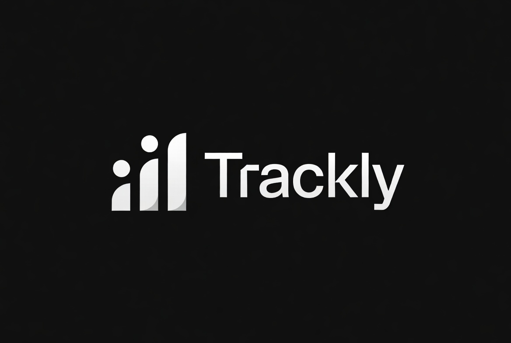

# 💰 Trackly - Personal Finance Dashboard

A modern, responsive web application for tracking personal finances with AI-powered features.



## ✨ Features

- **Real-time Dashboard** - Track income, expenses, and account balances
- **Account Management** - Support for multiple account types
- **Transaction Tracking** - Quick entry with smart categorization  
- **Receipt Processing** - AI-powered receipt scanning and data extraction
- **Scheduled Transactions** - Recurring income and expense tracking
- **Shopping Lists** - Integrated shopping with budget tracking
- **Mobile Optimized** - Responsive design for all devices
- **PWA Ready** - Install as a mobile app

## 🚀 Quick Start

### Production (Vercel)

- **Landing:** `/` — marketing site
- **App:** `/app/` — React dashboard + auth (Google, Apple, email)
- Live: https://trackly-neon.vercel.app/

### Local development

```bash
cd vite-app
npm install
npm run dev
```

Open http://localhost:5173/app/

Or run the full stack from the repo root: `npm run netrooo`

## 📁 Project layout

| Path | Purpose |
|------|---------|
| `vite-app/` | React app (dashboard + auth) served at `/app/` |
| `index.html` | Marketing landing page at `/` |
| `legacy/` | Archived classic HTML (not linked in production) |
| `docs/` | Internal implementation guides |
| `scripts/` | Vercel build + dev tooling |

## 🔧 Configuration

### 1. Create Configuration File

Copy `config.example.js` to `config.js` and update with your values:

```javascript
window.TRACKLY_CONFIG = {
  SUPABASE_URL: "https://your-project.supabase.co",
  SUPABASE_ANON_KEY: "your_supabase_key",
  FIREBASE_CONFIG: {
    apiKey: "your-firebase-api-key",
    authDomain: "your-project.firebaseapp.com",
    projectId: "your-project-id",
    // ... other Firebase config
  }
};
```

### 2. Set Up Firebase Authentication

1. Create a [Firebase project](https://console.firebase.google.com)
2. Enable Authentication → Google Sign-in
3. Add your domain to authorized domains
4. Update `config.js` with your Firebase configuration

### 3. Set Up Supabase Database

1. Create a [Supabase project](https://supabase.com)
2. Set up your database schema
3. Configure Row Level Security (RLS)
4. Update `config.js` with your Supabase URL and key

## 📱 Files Structure

```
trackly/
├── index.html              # Landing page
├── auth_fixed.html         # Authentication page  
├── trackly_dashboard.html  # Main application
├── config.example.js       # Configuration template
├── manifest.json          # PWA manifest
├── service-worker.js      # Service worker for PWA
├── logo-icon.png         # App icon
├── logo-full.png         # Full logo
└── README.md             # This file
```

## 🌐 Live Demo

Visit the live demo: [Trackly Demo](https://yourusername.github.io/trackly/)

## 🔐 Security

- Firebase Authentication with Google Sign-In
- Supabase Row Level Security (RLS)
- HTTPS enforcement
- No sensitive data stored locally

## 📄 License

MIT License - see [LICENSE](LICENSE) file for details.

## 🤝 Contributing

1. Fork the repository
2. Create a feature branch
3. Make your changes
4. Submit a pull request

---

**Made with ❤️ for better financial management**